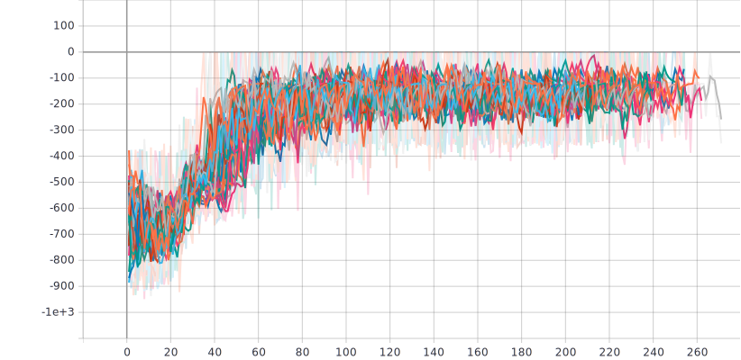
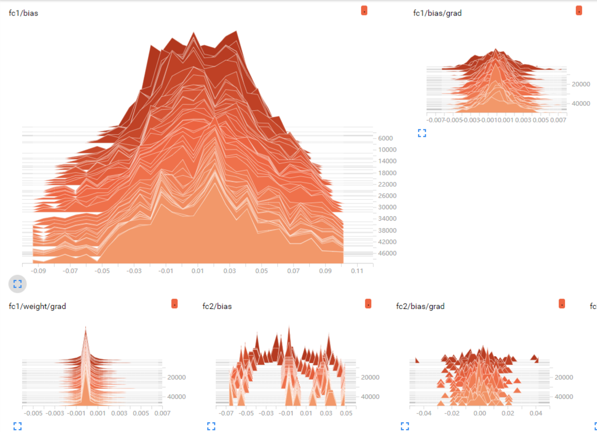
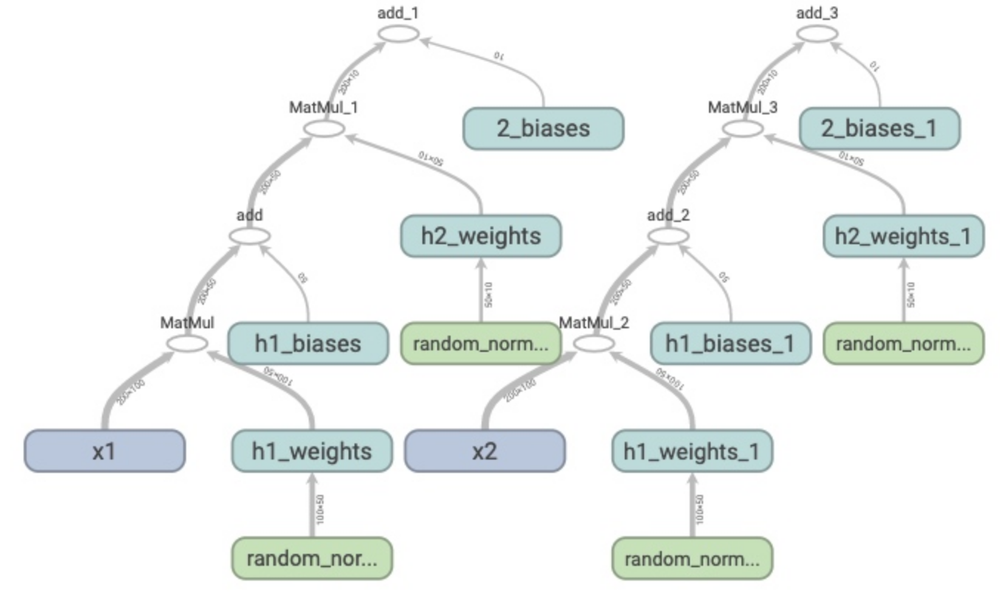

# DLVisualization

## Classification
* #### t-SNE

## Curve
* #### seaborn

* #### tensorboard/tensorboardX

# Reasoning
* #### grad_cam
               

# References
* https://github.com/kazuto1011/grad-cam-pytorch
* https://github.com/DmitryUlyanov/Multicore-TSNE
* https://github.com/CannyLab/tsne-cuda
* https://seaborn.pydata.org/
* https://tensorboardx.readthedocs.io/en/latest/tutorial.html