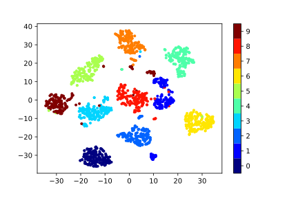
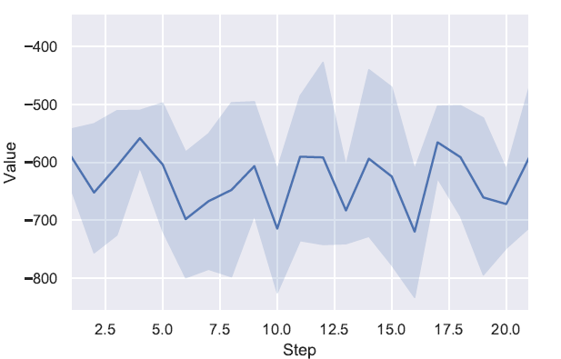
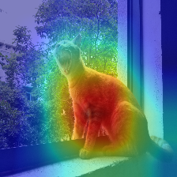

# DLVisualization

## Classification

## Curve

# Reasoning
               

# References
* https://github.com/kazuto1011/grad-cam-pytorch
* https://github.com/DmitryUlyanov/Multicore-TSNE
* https://github.com/CannyLab/tsne-cuda
* https://seaborn.pydata.org/